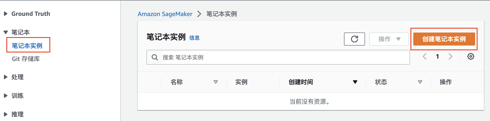
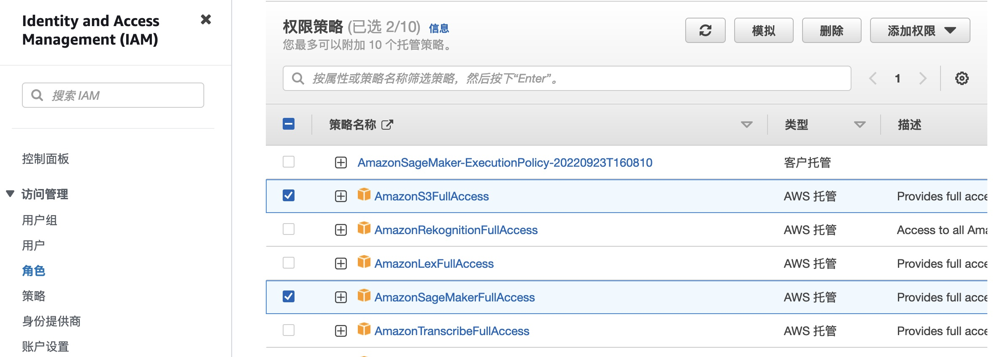
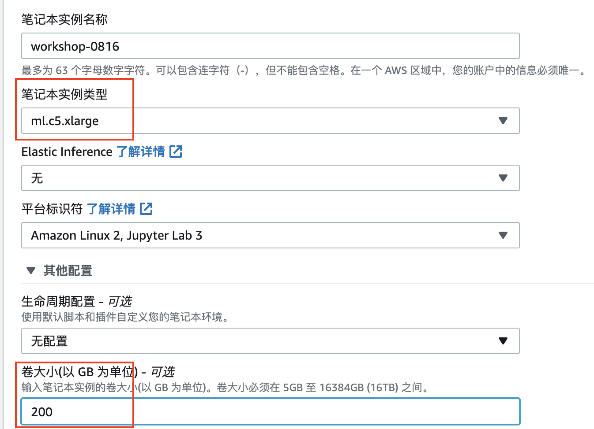
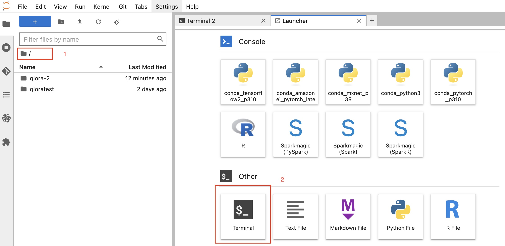
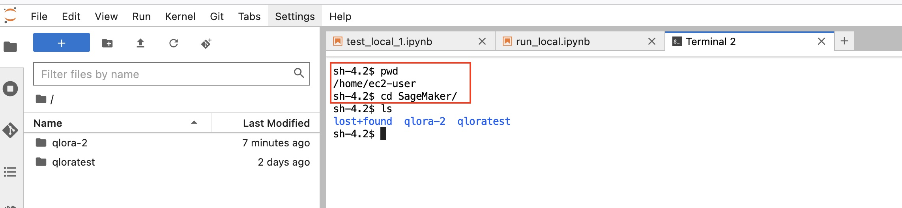
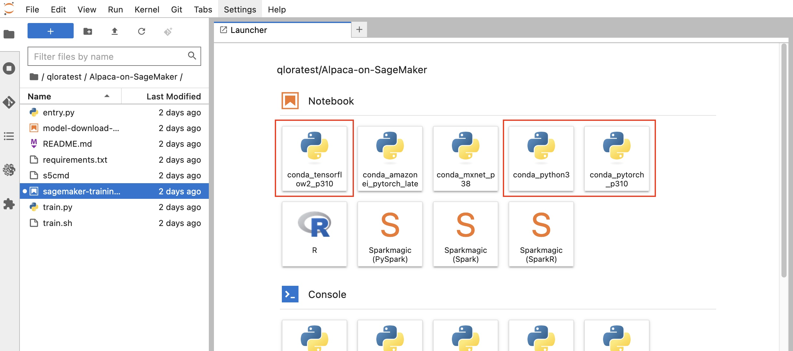
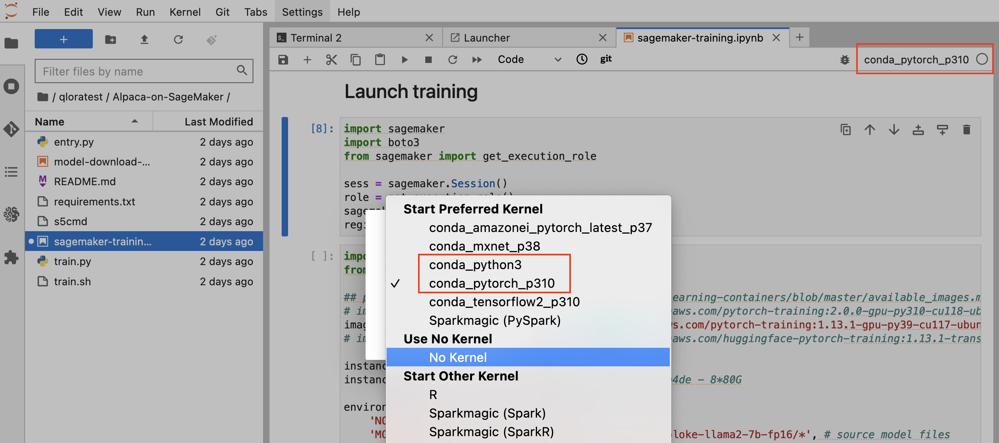

# SageMaker基本操作

### 0. SageMaker核心原理

本质上是一套可以pip install的SDK。用来调用、管理云上的其他资源（如存储、镜像）及算力（如GPU机器预处理、训练、推理）。


<br />
<br />

### 1. SageMaker Console中新建Notebook实例

进入AWS SageMaker Console之后，开始新建Notebook Instance


<br />
<br />

### 2. IAM Role所需权限
如SageMaker Notebook Instance，在创建时需要使用的IAM Role至少带有如下两类策略。或直接新建IAM Role，并随后补充追加。


<br />
<br />


### 3. SageMaker Notebook机型&EBS选择


<br />

1. 一般来说，由于SageMaker Notebook仅作为代码调试、拉起远端资源、镜像build&push、文件下载及其与S3的交换等用途，不直接进行数据处理、模型训练、部署推理等。因此，建议机型为```ml.c5.xlarge```或者```ml.m5.xlarge```。有时，如果需要在Notebook Instance本地进行GPU代码调试，或多卡（只能单机）的训练等，可以选用GPU机型，如```ml.g5.4xlarge```或者```ml.g5.12xlarge```等机型。
<br />
2. EBS存储，**建议200G以上**，用户下载暂存的模型，镜像构建等。
<br />
3. 补充：在Notebook上可以使用SageMaker Local Mode调试，与拉起远端Job时的接口一致，更便于直接扩展。参考google - SageMaker Local Mode。

<br />
<br />

### 4. JupyterLab环境介绍
Notebook Instance状态Ready之后，可以进入JupyterLab，界面如下。

<br />

1. 进入之后，左侧所见文件浏览器部分的绝对路径是```/home/ec2-user/SageMaker/```。
<br />
2. 首次进入时，左侧在文件浏览器处于```/```路径时，在右侧打开Terminal，使用```pwd```查看路径，得到```/home/ec2-user/```，因此需要先```cd SageMaker```。
<br />


<br />

3. 在其他任意**子路径**启动Terminal时，会默认在该路径下，不需要手动```cd```。

<br />
<br />


### 5. Notebook中开发
常用操作如下。
1. 新建notebook脚本：在Launcher中，选取对应的Kernel类型，打开notebook。


<br />

2. 基于现有的git repo：在所需路径下，打开Terminal，直接进行
```git clone https://github.com/XXX/YYY```

进入后需要选择kernel，一般只需要用到```conda_python3``` kernel。如果需要在Notebook上调试Deap Learning框架的代码如Tensorflow，pyTorch，则选择对应的tf，torch kernel。




