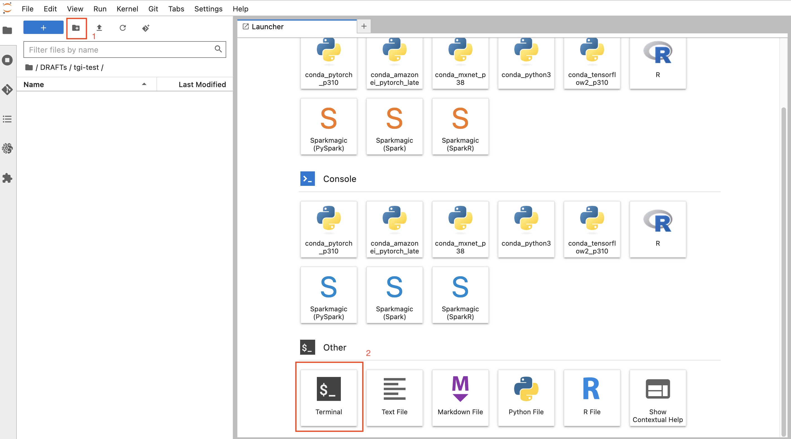
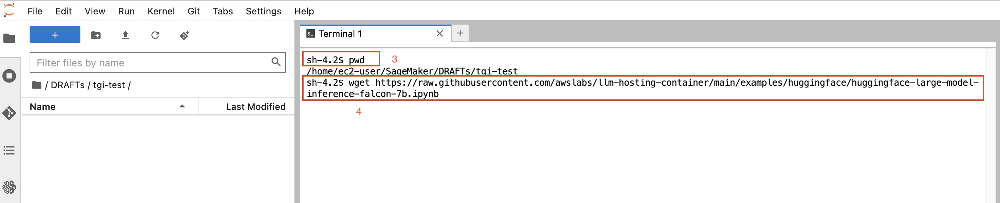
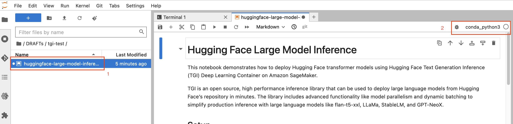
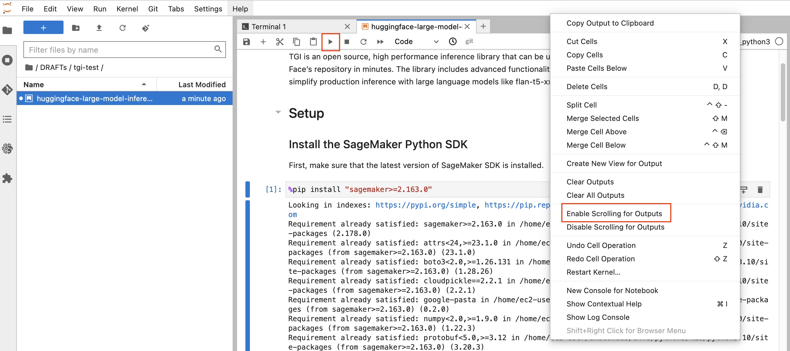
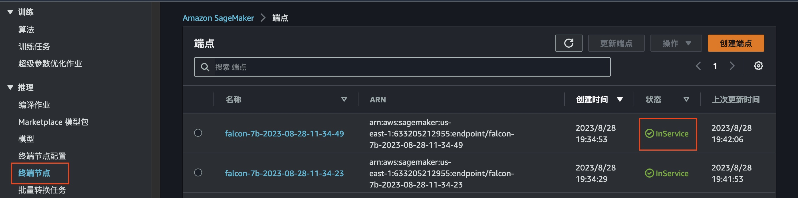

# Example Hosting with TGI

#### - Hugging Face’s Text Generation Inference (TGI) for LLM deployment

This independent experiment is based on HuggingFace TGI inference container to host a Llama2 model. More about TGI can be found in this Blog post - [Announcing the launch of new Hugging Face LLM Inference containers on Amazon SageMaker](https://aws.amazon.com/cn/blogs/machine-learning/announcing-the-launch-of-new-hugging-face-llm-inference-containers-on-amazon-sagemaker/).

The Sample Notebook to use TGI on SageMaker can be found [here](https://github.com/awslabs/llm-hosting-container/tree/main/examples/huggingface). (Basics to Start Experiment on SageMaker can be found in this [link](https://github.com/haozhx23/SageMaker-Utils/blob/main/0-How-to-start.md))

Below is how we start hosting a Falcon-7b model in SageMaker.

### 1. Download Sample Code
We will use SageMaker Notebook instance to launch the experiment.
> 1. Create a new path, and enter this new path
> 2. On this new path, start a new terminal

 

> 3. Use command `pwd` to check if the path is correct
> 4. Execute `wget https://raw.githubusercontent.com/awslabs/llm-hosting-container/main/examples/huggingface/huggingface-large-model-inference-falcon-7b.ipynb` to download the Sample Notebook script

 

### 2. Start the Model Deployment
Use the Sample Notebook downloaded to deploy a Falcon-7b model on an AWS g5.2xlarge instance.
> 1. Double-click the .ipynb script from the left file explore
> 2. Choose the kernel `conda_python3`

 

> 3. Execute every code cell

 

> [!NOTE]
> <mark>Restart the kernel after new pip installation</mark> (variables in memory will be cleared)
 

### 3. Check Endpoint Status
After the `model.deploy()` API call finished, we check the Endpoint status in the SageMaker Console, should be `InService`.

 

### Refs

AWS Blog - https://aws.amazon.com/cn/blogs/machine-learning/announcing-the-launch-of-new-hugging-face-llm-inference-containers-on-amazon-sagemaker/
 
TGI Sample Code - https://github.com/awslabs/llm-hosting-container/tree/main/examples/huggingface
 
TGI Llama2-70b Sample Code - https://github.com/aws-samples/sagemaker-hosting/tree/main/GenAI-Hosting/Large-Language-Model-Hosting/LLM-Deployment-SageMaker/TGI/Llama2-70B-Chat
